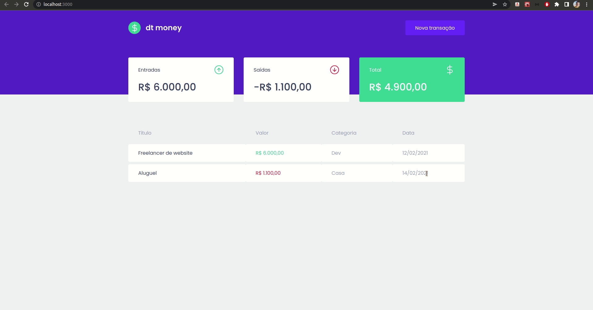

<p align="center">
  
</p>

## 📖 Sobre

Projeto desenvolvido durante o Ignite da Rocketseat | Trilha ReactJS Chapter II - Primeira aplicação web.

</br>

## ⚙ Tecnologias

Esse projeto foi desenvolvido com as seguintes tecnologias:

- [React](https://www.reactjs.org)
- [Styled-Components](https://styled-components.com)
- [TypeScript](https://www.typescriptlang.org)
- [MirageJS](https://miragejs.com)

</br>

## 💻 Projeto

O dtmoney é uma aplicação de controle de finanças pessoais.

</br>

## 👷 Como executar 🚀

- Clone o repositório
```
git clone https://github.com/ericlys/ignite_react-js.git
```
- Entre na pasta do projeto
```
cd 02-dtmoney
```
- Instale as dependências
```
yarn
```
- Inicie o servidor
``` 
yarn start
```
- Acesse no seu navegador
```
http://localhost:3000
```
